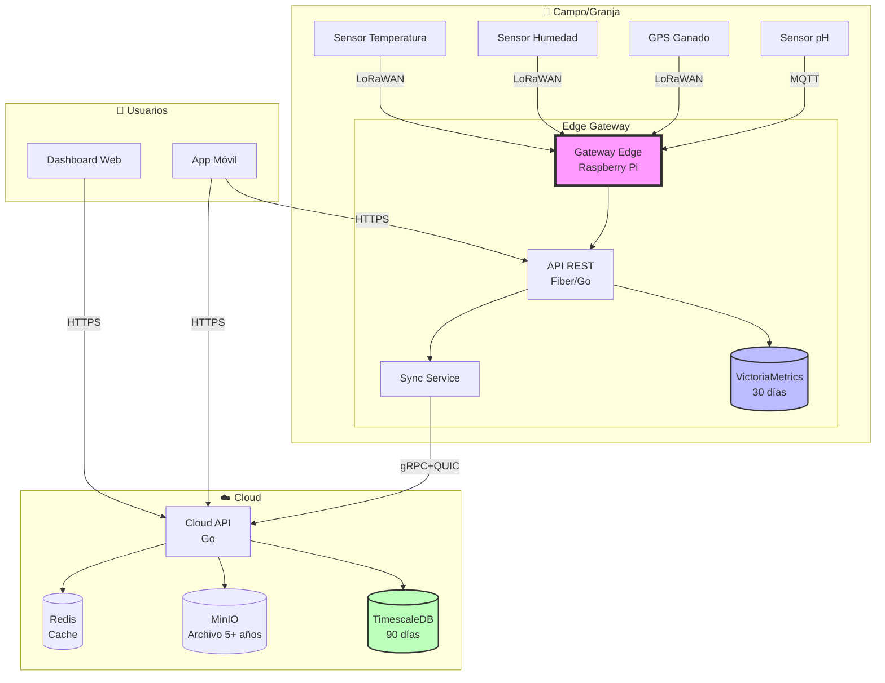

# SensorWave

## Arquitectura

```mermaid
graph TB
    subgraph "🌾 Campo/Granja"
        S1[Sensor Temperatura] -->|LoRaWAN| GW[Gateway Edge<br/>Raspberry Pi]
        S2[Sensor Humedad] -->|LoRaWAN| GW
        S3[GPS Ganado] -->|LoRaWAN| GW
        S4[Sensor pH] -->|MQTT| GW
        
        subgraph "Edge Gateway"
            GW --> API1[API REST<br/>Fiber/Go]
            API1 --> VM[(VictoriaMetrics<br/>30 días)]
            API1 --> SYNC[Sync Service]
        end
    end
    
    subgraph "☁️ Cloud"
        SYNC -->|gRPC+QUIC| API2[Cloud API<br/>Go]
        API2 --> TS[(TimescaleDB<br/>90 días)]
        API2 --> MINIO[(MinIO<br/>Archivo 5+ años)]
        API2 --> REDIS[(Redis<br/>Cache)]
    end
    
    subgraph "👥 Usuarios"
        WEB[Dashboard Web] -->|HTTPS| API2
        MOB[App Móvil] -->|HTTPS| API1
        MOB -->|HTTPS| API2
    end
    
    style GW fill:#f9f,stroke:#333,stroke-width:4px
    style VM fill:#bbf,stroke:#333,stroke-width:2px
    style TS fill:#bfb,stroke:#333,stroke-width:2px
```